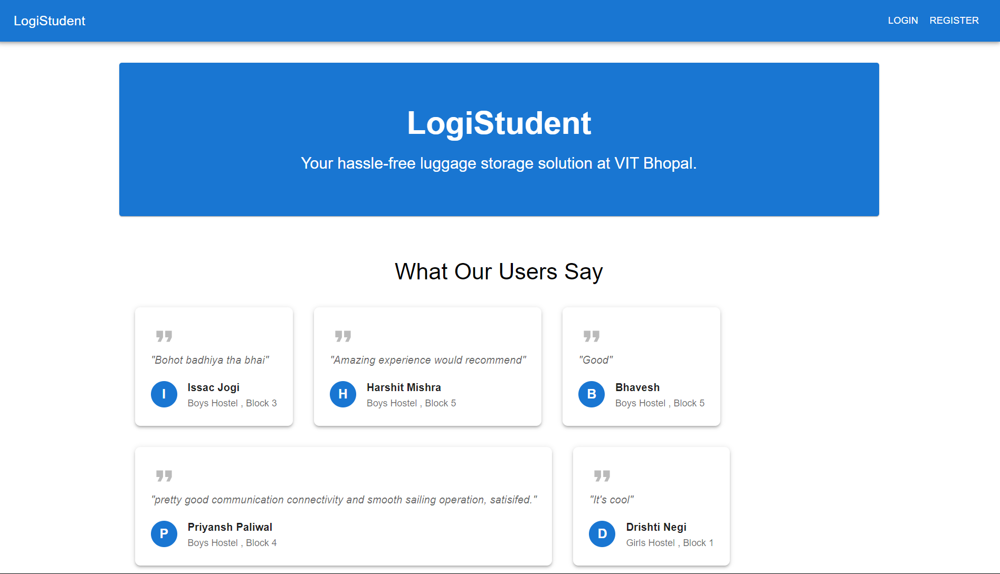
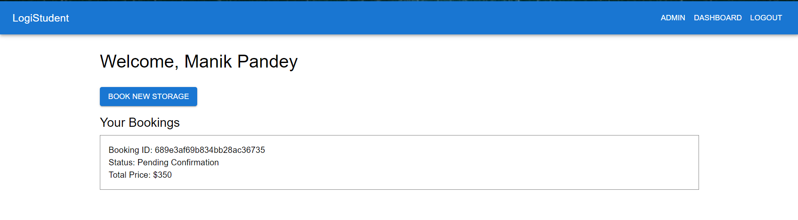
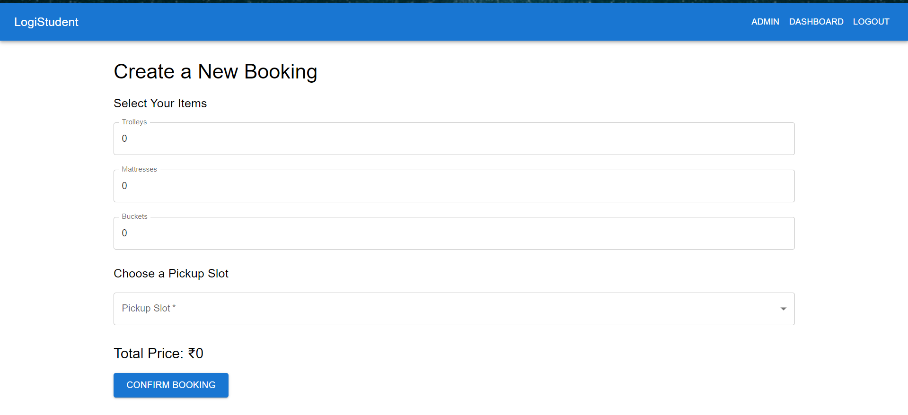
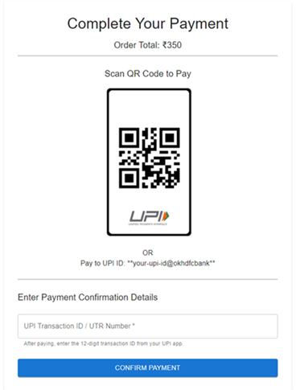
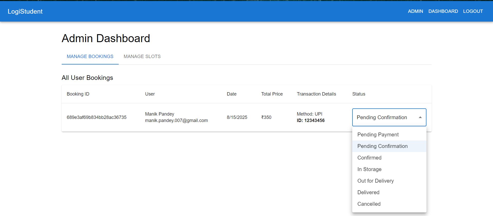
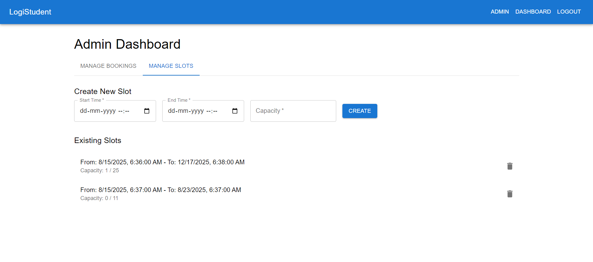

**LogiStudent: Full-Stack Campus Logistics Platform**

**A comprehensive, production-ready MERN stack application designed to solve the real-world problem of student luggage storage and management during semester breaks.**

**Live Demo & API**

*   **Live Project Link:** [**https://imaginative-hotteok-8268cb.netlify.app/**](https://imaginative-hotteok-8268cb.netlify.app/ "null")
*   **Live Server API:** [**https://logistudent.onrender.com**](https://logistudent.onrender.com "null")

**1\. Project Overview**

**The Problem**

At the end of every semester, students at campuses like VIT Bhopal face a significant logistical challenge: securing and transporting their personal belongings. This process is often chaotic, relying on informal manual coordination, leading to stress, potential loss of items, and a lack of a centralized, reliable system.

**The Solution**

LogiStudent is a multi-role web application that digitizes and automates this entire workflow. Born from a real-life service successfully executed for over 50 students, this project transforms a manual operation into a seamless, scalable, and professional digital platform. It provides a secure and user-friendly experience for students while equipping administrators with a powerful dashboard to manage all operational aspects efficiently.

**2\. Key Features**

**Student-Facing Features:**

*   **Secure JWT Authentication:**

*   Full user registration, login, and logout flow.
*   Passwords are encrypted using bcrypt.js.
*   Secure, token-based session management ensures private routes are protected.

*   **Dynamic Homepage:**

*   Features real user testimonials fetched directly from the database to build social proof and trust.
*   Serves as an engaging landing page for new and returning users.

*   **Personalized Student Dashboard:**

*   An authenticated, private area for students to view their complete booking history.
*   Real-time status updates for each booking (e.g., "Pending Confirmation", "In Storage", "Delivered").
*   Displays payment details, including submitted transaction IDs.

*   **Multi-Step Booking System:**

*   An intuitive form for selecting multiple item types (trolleys, mattresses, etc.).
*   Dynamically calculates the total price in real-time as items are added.
*   Fetches and displays available pickup slots directly from the database, preventing overbooking.

*   **Manual Payment Confirmation Flow:**

*   A practical payment page featuring a static UPI QR code and UPI ID.
*   A dedicated form for users to submit their UPI transaction ID, which is then visible to the admin for verification.

**Technology Stack**

*   **Frontend:** React, Redux Toolkit (for state management), React Router, Axios, Material-UI
*   **Backend:** Node.js, Express.js, Mongoose
*   **Database:** MongoDB (with MongoDB Atlas for cloud hosting)
*   **Authentication:** JSON Web Tokens (JWT), bcrypt.js for password hashing
*   **Deployment:**

*   **Backend API:** Render
*   **Frontend Client:** Netlify

**Admin-Facing Features:**

*   **Role-Based Access Control:**

*   A secure, private dashboard accessible only to users with the admin role.
*   The UI dynamically renders admin-specific navigation links upon login.

*   **Comprehensive Booking Management:**

*   A centralized table displaying all user bookings in the system.
*   User details (name, email) are populated from the users collection for easy reference.
*   Submitted transaction IDs are clearly visible for payment verification.

*   **Interactive Status Updates:**

*   Admins can instantly update the status of any booking via a simple dropdown menu.
*   Changes are reflected in real-time on both the admin and student dashboards.

*   **Full Slot Management (CRUD):**

*   The dashboard includes a complete interface for creating, viewing, and deleting available time slots.
*   This makes the application fully manageable without external tools like Postman or Hopscotch.

*   **Intelligent Capacity Tracking:**

*   The system automatically increments a slot's bookingsCount when a new booking is made.
*   The count is automatically decremented if an admin cancels a booking, freeing up the slot.

**3\. Architectural Highlights & Technology Stack**

This project was built using the **MERN** stack, chosen for its flexibility, scalability, and the seamless integration of JavaScript across the entire application.

**4\. Screenshots**

Homepage with Testimonials 
  
 

Student Dashboard

New Booking Form  
  

Payment Page

  

Admin - Booking Management

Admin - Slot Management 



**5\. Getting Started (Local Setup)**

To get a local copy up and running, follow these simple steps.

**Prerequisites**

*   Node.js and npm installed
*   MongoDB installed locally or a MongoDB Atlas account


**Installation & Setup**

1.  **Clone the repository:**
    ```bash
    git clone https://github.com/ManikPandey/LogiStudent.git

    cd logistudent
    ```

4.  **Setup the Backend Server:**

*   Navigate to the server directory: 
    ```bash
    cd server
    ```
*   Install NPM packages: 
    ```bash
    npm install
    ```
*   Create a ```.env``` file in the ```server``` directory and add the required environment variables (see template below).
*   Run the seeder to populate the database with initial data (optional): 
    ```bash
    npm run seed
    ```
6.  **Setup the Frontend Client:**

*   Navigate to the client directory from the root folder: 
    ```bash
    cd client
    ```
*   Install NPM packages: 
    ```bash
    npm install
    ```
8.  **Run the Application:**

*   Run the backend server from the server directory: 
    ```bash
    npm run dev
    ```
*   Run the frontend client from the client directory in a separate terminal: 
    ```bash
    npm start
    ```
*   The application will be available at ```http://localhost:3000```

**6\. Environment Variables**

To run this project, you will need to add the following environment variables to your .env file in the /server directory:

```MONGO\_URI=your\_mongodb\_connection\_string```

```JWT\_SECRET=your\_super\_secret\_jwt\_string```

**Why it's great for this project:**

**MVP-Focused:** It demonstrates an understanding of building a Minimum Viable Product—delivering core value (tracking transparency for the user) without unnecessary complexity or cost.

**Cost-Effective:** It entirely avoids the overhead of printers, scanners, and maintenance, making it perfectly suited for a lean, student-run operation.

**Operationally Robust:** The system is simple and reliable, with no technical points of failure like unreadable QR codes or scanner malfunctions.

**Maintains User Transparency:** The most important benefit is preserved: the student still sees the real-time status of their luggage on their personal dashboard, building trust and reducing anxiety.

**API Endpoint Design: Define your REST API routes.**

**POST /api/auth/register**

**POST /api/auth/login**

**POST /api/bookings**

**GET /api/bookings/me (get bookings for logged-in user)**

**GET /api/admin/bookings (protected admin route)**